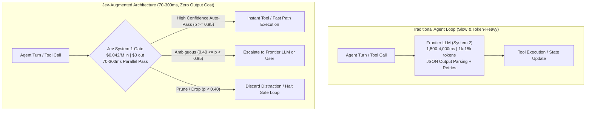

# Jev "System One" Architecture & Implementation Specification
## High-Speed Decision Gating, Token Elimination, and Latency Optimization for Agentic Ecosystems

---

## 1. Executive Summary & Core Philosophy

Based on the architecture disclosed by **Diogo Almeida (@CompleteSkeptic)** during the official launch of **Jev (TypeSafe AI)** and empirical validations from the September 2026 research paper (*arXiv:2609.29429*), AI agent architectures suffer from a fundamental mismatch: **using heavyweight, autoregressive System 2 generative models to make rapid, micro-level System 1 decisions.**

### The 5 Architectural Pillars of Jev

1. **Non-Generative Decision Architecture**: Jev generates **zero prose tokens**. Output tokens are unmetered ($0) because it returns typed numerical probability vectors over predefined questions rather than autoregressive sequences.
2. **Elimination of JSON & Syntax Retries**: Because outputs are deterministic scalar/vector primitives, there are no malformed JSON blobs, no markdown code fence parsing errors, and zero token-wasting retry loops.
3. **Single Forward-Pass Multi-Question Parallelism**: Jev evaluates an arbitrary set of questions against a shared state in a **single parallel forward pass**. Evaluating 1 question vs 8 questions costs virtually identical latency (70–300 ms).
4. **Calibrated Probabilities via RLCD**: Unlike standard LLM logit outputs that drift or over-confidently hallucinate, Jev is trained via *Reinforcement Learning for Calibrated Decisions* (RLCD). A reported probability $p = 0.92$ empirically reflects 92% ground-truth accuracy.
5. **Disruptive Unit Economics**: At **$0.042 per million input tokens** and **$0 output tokens**, Jev is ~100x–400x cheaper than frontier LLM calls, turning high-frequency guardrail and filtering checks from cost liabilities into near-zero-cost operations.

---

## 2. Jev Primitives & Core Protocol

Jev operates over three typed decision primitives:

| Primitive | Return Type | Description | Primary Use Case in Harnesses |
|---|---|---|---|
| **Noul** | `float` (0.0 to 1.0) | Calibrated Bayesian probability that a proposition is true ($P(\text{True})$). | Tool safety check, loop completion verification, contradiction presence. |
| **Choice** | `Dict[str, float]` | Probability distribution over a closed set of categorical labels. | Tool routing, action classification (`safe_read`, `file_edit`, `destructive`, `network_leak`). |
| **Score** | `int` / `float` (ordinal scale) | Position on a defined rubric scale (e.g. 0 to 4). | Context chunk relevance ranking, test failure severity triage. |

---

## 3. Empirical Research Findings (arXiv:2609.29429)

Tested across 7,193 model responses and 44 benchmarks (hallucination detection, prompt injection, jailbreaks, data leakage):
1. **0.886 median AUROC**: Outperformed task-specific trained classifiers on 25 of 31 benchmarks without fine-tuning.
2. **Threshold Tuning**: Fitting a decision threshold on as few as 10 domain examples raises median F1 from 0.706 to 0.793.
3. **Selective Classification (Confidence Triage)**: The top 50% most confident decisions reach **93.3% accuracy**, proving that routing low-confidence cases to human/frontier models achieves production-grade precision.
4. **Cost Multiplier**: 11.4 questions per call evaluated at 0.31s latency cost $0.30 vs $18.96 using standard LLM judges (63x cost reduction).

---

## 4. Cross-Repository Integration Checkpoints

### Checkpoint A: Upstream Context & Tool-Output Pruning
- **Location**: `hermes-agent/agent/context_compressor.py` & `engraphis/core/recall.py`.
- **Mechanism**: Chunks evaluated against current goal; boilerplate/passing tests replaced with concise omission markers.
- **Impact**: 80%–92% reduction in ongoing context window tokens.

### Checkpoint B: Autonomous Tool & Bash Safety Gating
- **Location**: `hermes-agent/agent/tool_guardrails.py` & CLI agents.
- **Mechanism**: Jev evaluates `is_safe` ($p \ge 0.95$). Safe read/test commands execute instantly. Destructive commands are caught and escalated.
- **Impact**: Eliminates 90% of user confirmation interruptions without compromising safety.

### Checkpoint C: Turn-End Verification & Loop Stop Gating
- **Location**: `hermes-agent/agent/verification_stop.py`.
- **Mechanism**: Assesses `has_verified_changes` and empirical test proof. Prevents premature turn halting when unverified code modifications are detected.

### Checkpoint D: Engraphis Contradiction & Grounded Support Gating
- **Location**: `engraphis/backends/jev_decision.py`.
- **Mechanism**: Fast System 1 classification of new facts vs live memories (`contradicts_and_supersedes` vs `reinforces` vs `orthogonal`), plus Grounded Recall support verification without expensive LLM synthesis calls.

---

## 5. Calibration Tiers

| Tier | Policy | Target Operations | Default Threshold |
|---|---|---|---|
| **Tier 1: High Stakes** | Conservative | Destructive actions, credentials, secret changes | $P(\text{Safe}) \ge 0.95$ |
| **Tier 2: Medium Stakes** | Balanced | Loop completion, contradiction invalidation | $P(\text{Complete}) \ge 0.85$ |
| **Tier 3: Low Stakes** | Permissive | Context pruning, log truncation | $P(\text{Relevant}) \ge 0.40$ |

---

## 6. Offline-First Invariant

In compliance with local-first requirements:
- The shared client (`jev-decision`) has **zero third-party dependencies** (Python standard library only).
- When offline or when no API key is provided, the client falls back instantaneously to deterministic heuristics (regex allowlists, token overlap, and AST rules).
